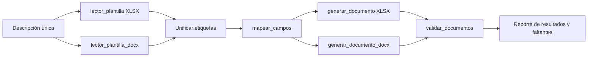

Haré una revisión de solo lectura del flujo actual, incluyendo lectores, generadores, pruebas y el script de ejecución. El objetivo es diseñar un orquestador que reutilice las piezas existentes, centralice el reporte de faltantes y valide ambas copias sin tocar ninguna plantilla.

Read 

Read 

Read 

Read 

Read 

Read 

Read 

Read 

**Arquitectura Propuesta**

1. Leer las etiquetas de `plantillas/Historia de usuario.xlsx` con `leer_plantilla()`.
2. Leer las etiquetas de la plantilla DOCX con `leer_plantilla_docx()`.
3. Unificar etiquetas, conservando el orden y eliminando duplicados.
4. Mapear una sola descripción contra ese conjunto unificado.
5. Generar:
   - `output/Historia_de_usuario_generada.xlsx`
   - `output/Especificaciones_tecnicas_generadas.docx`
6. Validar que ambos archivos existan, que sus plantillas no hayan cambiado y que los valores mapeados se encuentren en sus destinos.
7. Devolver un reporte estructurado: rutas generadas, campos completados, faltantes y advertencias.

**Reutilización**

- Se reutilizan sin duplicar lógica:
  - `lector_plantilla.py`
  - `lector_plantilla_docx.py`
  - `mapeo_campos.py`
  - `generador_doc.py`
  - `generador_docx.py`

**Cambio Necesario en Mapeo**

Actualmente `mapear_campos()` llama a `input()` para cada etiqueta ausente. Para un flujo automatizado que “reporte y no invente”, conviene añadir un parámetro opcional, por ejemplo `solicitar_faltantes=True`:

- `True`: mantiene el comportamiento actual de consola.
- `False`: devuelve `None` para campos no encontrados y los incluye en un reporte de faltantes.

El orquestador usaría `False`; los generadores deben omitir valores `None` y registrar advertencia. El generador DOCX ya lo hace; el XLSX requeriría ese ajuste para no escribir una celda vacía como si estuviera completada.

**Archivos a Crear**

- `src/orquestador_documentos.py`
  - Coordina lectores, mapeo, generadores y validación.
  - No contiene reglas específicas de XLSX/DOCX.
  - Devuelve un diccionario de resultados.

- `src/validador_documentos.py`
  - Verifica existencia de salidas.
  - Compara hashes de las plantillas antes/después.
  - Reabre los documentos generados para validar campos que sí tenían valor.
  - Reúne advertencias y campos pendientes.

- `test/test_orquestador_documentos.py`
  - Prueba generación de ambas salidas desde una descripción.
  - Prueba reporte de faltantes.
  - Prueba que ninguna plantilla se modifica.

- `test/test_validador_documentos.py`
  - Prueba validación de archivos, hashes y reporte.

**Archivos a Modificar**

- `mapeo_campos.py`: modo no interactivo y reporte de ausencias.
- `generador_doc.py`: omitir y advertir ante valor `None`.
- `probar_flujo.py`: reemplazar el flujo XLSX aislado por una llamada al orquestador, o crear un nuevo script de entrada como `generar_documentos.py`.

La plantilla DOCX mantendrá como pendiente `Requisitos del Producto:` hasta que se defina un destino inequívoco en su estructura.
